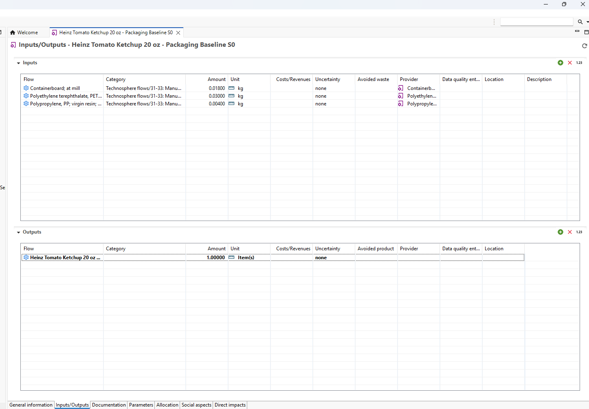
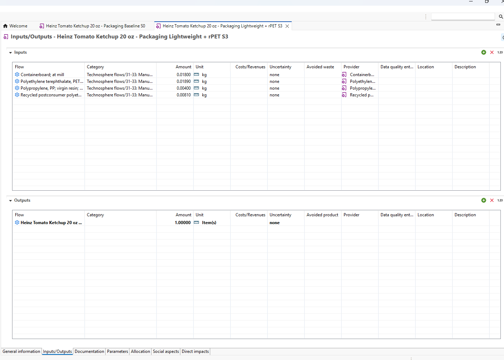
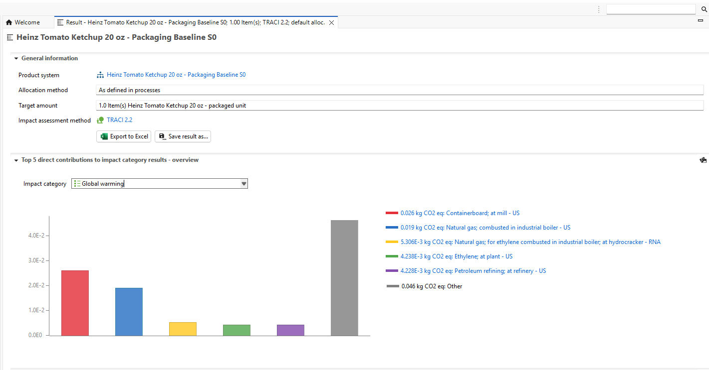
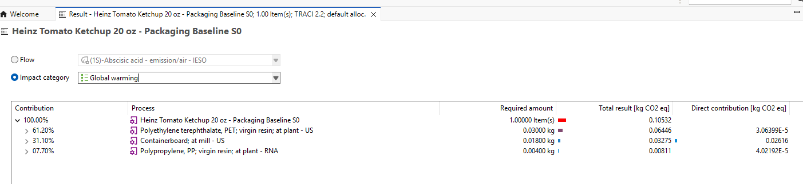
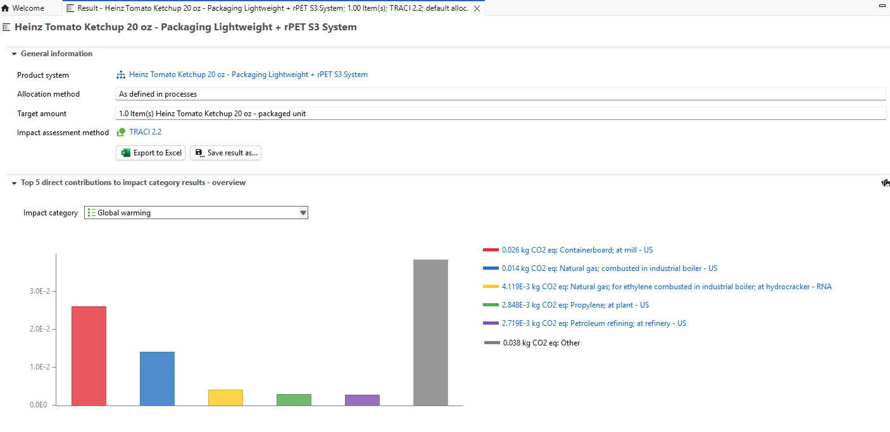
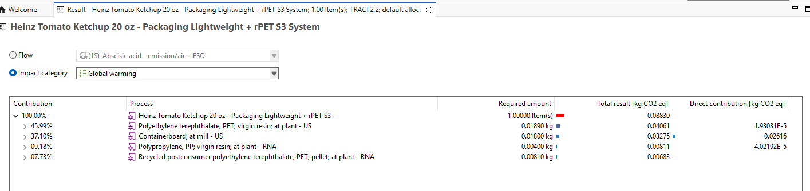

# openLCA model

This folder contains the openLCA part of my packaging case study for a Heinz Tomato Ketchup 20 oz bottle.

I used openLCA to compare a baseline package with lightweighting and recycled PET scenarios. My main goal was to understand how changes in the bottle design affect packaging-related greenhouse gas emissions before connecting those results to the California EPR and financial parts of the project.

## What I modeled

Functional unit:

**1 packaged Heinz Tomato Ketchup 20 oz unit**

The current model is a screening cradle-to-gate packaging-material assessment.

Included in the model:

- virgin PET resin
- recycled PET resin where applicable
- PP cap resin
- containerboard

Not currently included:

- label production
- bottle forming
- cap molding
- corrugated converting
- filling
- distribution
- consumer use
- end-of-life

I used **TRACI 2.2** and focused on global warming potential.

## Scenarios

I modeled four scenarios:

| Scenario | Description |
|---|---|
| S0 | Baseline |
| S1 | 10% PET bottle lightweighting |
| S2 | 30% recycled PET |
| S3 | 10% lightweighting + 30% recycled PET |

These are modeling scenarios for this case study and are not Kraft Heinz commitments.

## Results

| Scenario | GWP (kg CO2e/package) | Reduction vs. baseline |
|---|---:|---:|
| S0 | 0.10532 | — |
| S1 | 0.09887 | 6.12% |
| S2 | 0.09357 | 11.16% |
| S3 | 0.08830 | 16.16% |

The baseline model shows PET as the largest packaging hotspot.

The combined S3 scenario gives the largest modeled GWP reduction in this screening analysis.

## Files in this folder

- `model_configuration.md` — model setup, system boundary and main assumptions
- `scenario_inputs.csv` — material inputs used for S0–S3
- `results_summary.csv` — summarized GWP results
- `screenshots/` — selected openLCA model and result views

## Baseline inputs

The baseline foreground process uses:

- 30 g virgin PET
- 4 g PP
- 18 g containerboard

## Combined lightweighting + rPET inputs

For S3, the PET bottle mass is reduced from 30 g to 27 g, with 30% of the bottle resin modeled as recycled PET.

This gives:

- 18.9 g virgin PET
- 8.1 g recycled PET
- 4 g PP
- 18 g containerboard

## Baseline GWP result

The baseline screening result is:

**0.10532 kg CO2e per packaged unit**

The contribution view shows PET as the largest modeled contributor, followed by containerboard and PP.

## Combined scenario result

The S3 screening result is:

**0.08830 kg CO2e per packaged unit**

This is about a **16.2% reduction** compared with the modeled baseline.

The contribution view shows the change in the material mix after lightweighting and recycled PET are introduced.

## Important note

This is an independent screening model developed for learning and portfolio use.

Some packaging masses and material choices are based on documented assumptions or proxies where product-specific public data was not available.

The model has not undergone external critical review and should not be interpreted as an official Kraft Heinz product footprint, LCA, or corporate commitment.
