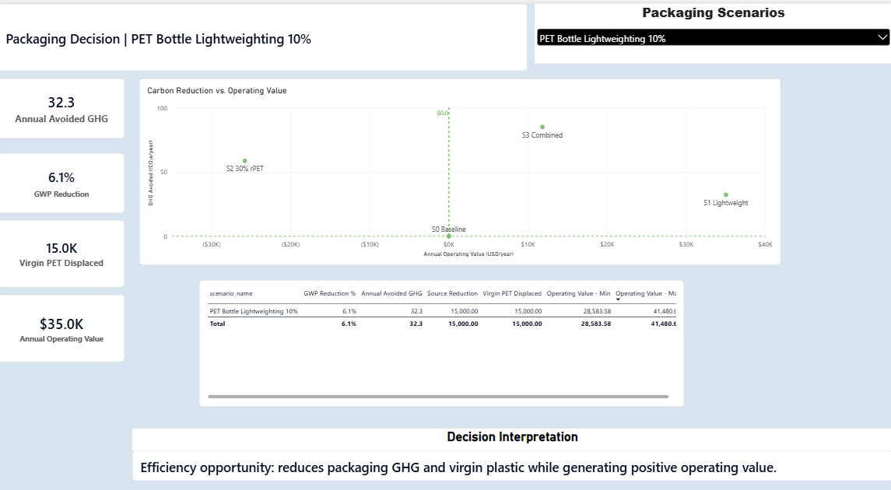
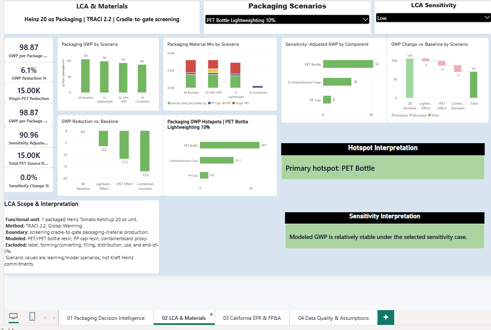
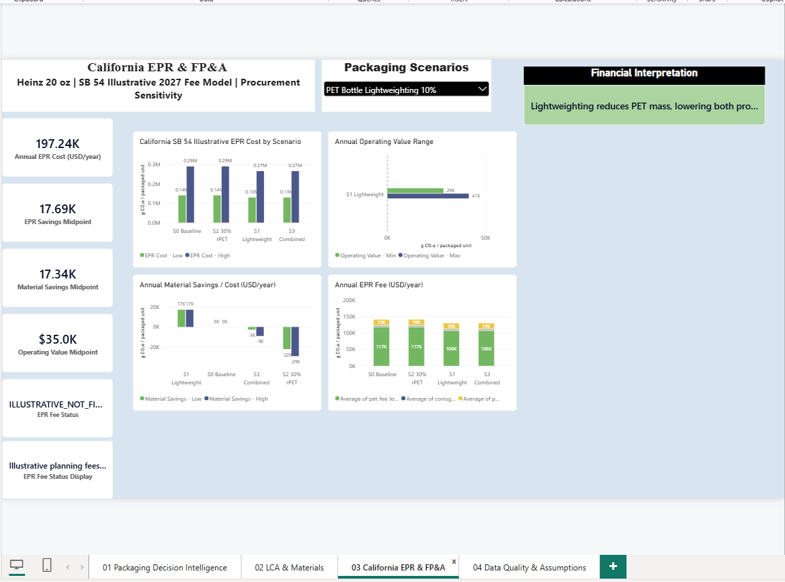

# Power BI report

This folder contains the Power BI part of the packaging case study.

I used Power BI to bring together the LCA, California EPR, material, and financial scenario outputs into a small decision-support report.

The report has three main pages.

## Page 1 - Packaging Decision Intelligence

This page compares the four packaging scenarios from both an environmental and financial perspective.

It includes:

- annual avoided GHG
- GWP reduction
- virgin PET displacement
- annual operating value
- scenario comparison
- financial interpretation

The main purpose is to show that the scenario with the best environmental result is not always the same as the scenario with the strongest near-term financial result.

## Page 2 - LCA & Materials

This page focuses on the environmental model.

It includes:

- GWP per package
- reduction versus baseline
- packaging material mix
- openLCA contribution results
- material hotspots
- sensitivity testing

The page is intended to connect the openLCA results with the material changes behind each scenario.

## Page 3 - California EPR & FP&A

This page connects the packaging scenarios with California EPR and procurement economics.

It includes:

- illustrative EPR cost
- EPR savings versus baseline
- PET procurement impact
- annual operating value range
- financial interpretation

The California fee values are used for planning analysis and are not treated as final producer invoices.

## Data model

The Power BI model uses a scenario dimension connected to several fact tables.

The main design rule was to avoid fact-to-fact relationships and keep scenario filtering controlled through `DimScenario`.

The main tables include:

- FactPackagingScenario
- FactLCAComponent
- FactScenarioMaterial
- FactEPRScenario
- FactProcurementScenario
- DimScenario

The final scenario table has one row for each of the four modeled scenarios.

## Important note

This report is part of an independent portfolio case study.

Some inputs are based on public sources, while others are clearly labeled as proxy, illustrative, or synthetic assumptions.

The report should not be interpreted as an official Kraft Heinz dashboard or financial analysis.